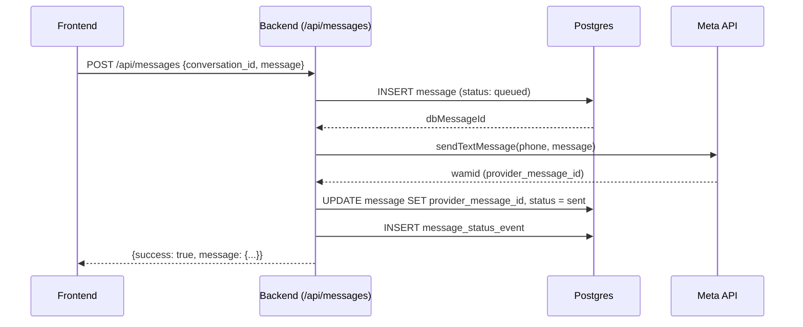

# 🔄 Marco 1 Restaurado - Sistema Relacional

**Data:** 23/01/2026  
**Status:** ✅ Implementado

## 📋 Resumo

Retornamos ao Marco 1, restaurando o sistema para usar exclusivamente as tabelas relacionais do Postgres em vez do KV Store. Todas as operações de conversas e mensagens agora usam queries SQL diretas nas tabelas.

---

## 🔧 Alterações Implementadas

### 1. **Backend - Novas Rotas Relacionais**

Adicionadas três rotas principais no arquivo `/supabase/functions/server/index.tsx`:

#### 📥 GET `/api/conversations`
- **Descrição:** Lista conversas atribuídas ao usuário autenticado
- **Autenticação:** Obrigatória via Bearer token
- **Método:** Query SQL com JOINs
- **Retorna:** 
  - Conversas com dados completos
  - Contato associado (contacts)
  - Unidade (units)
  - Usuário atribuído (profiles)

```typescript
// Estrutura da query
.from('conversations')
.select(`
  *,
  contacts (*),
  units (*),
  profiles (*)
`)
.eq('assigned_user_id', user.id)
.order('last_message_at', { ascending: false })
```

#### 📥 GET `/api/messages/:conversationId`
- **Descrição:** Lista mensagens de uma conversa específica
- **Autenticação:** Obrigatória
- **Validação:** Verifica se o usuário tem permissão para acessar a conversa
- **Retorna:** Array de mensagens ordenadas por `sent_at`

#### 📤 POST `/api/messages`
- **Descrição:** Envia mensagem de texto
- **Autenticação:** Obrigatória
- **Fluxo:**
  1. Valida conversa e permissão do usuário
  2. Salva mensagem no DB com status `queued`
  3. Envia para API da Meta via WhatsApp
  4. Atualiza mensagem com `provider_message_id` (wamid) da Meta
  5. Registra evento de status em `message_status_events`

---

### 2. **Frontend - ConversationList.tsx**

Atualizado para usar a nova rota relacional:

**Antes (Marco 2):**
```typescript
fetch(`/api/kv/conversations`)
```

**Depois (Marco 1):**
```typescript
fetch(`/api/conversations`)
```

#### Mudanças principais:
- ✅ Endpoint alterado de `/api/kv/conversations` → `/api/conversations`
- ✅ Dados já vêm formatados corretamente do backend
- ✅ Removida transformação de dados (não é mais necessária)
- ✅ Correção no badge de `assigned_user`: usa `nome` e `sobrenome` em vez de `full_name`

---

### 3. **Frontend - ChatView.tsx**

✅ **Nenhuma alteração necessária**

O ChatView já estava usando queries diretas do Supabase para buscar mensagens, que é o método correto para o Marco 1:

```typescript
supabase
  .from('messages')
  .select('*')
  .eq('conversation_id', conversation.id)
  .order('sent_at', { ascending: true })
```

---

## 🗂️ Estrutura de Dados Relacional

### Tabelas Principais

#### **conversations**
```sql
- id (uuid, PK)
- contact_id (uuid, FK → contacts.id)
- unit_id (uuid, FK → units.id)
- status (enum: open, pending, waiting_customer, closed)
- assigned_user_id (uuid, FK → profiles.id)
- assigned_at (timestamp)
- last_message_preview (text)
- last_message_at (timestamp)
- created_at (timestamp)
- updated_at (timestamp)
```

#### **messages**
```sql
- id (uuid, PK)
- conversation_id (uuid, FK → conversations.id)
- direction (enum: inbound, outbound)
- type (enum: text, template, image, video, document, audio)
- body (text)
- media_url (text)
- provider_message_id (text) -- wamid da Meta
- sent_at (timestamp)
- status (enum: queued, sent, delivered, read, failed)
- created_at (timestamp)
```

#### **contacts**
```sql
- id (uuid, PK)
- wa_id (text, unique) -- apenas números
- phone_number (text, unique) -- formato E.164 com +
- display_name (text)
- first_name (text)
- last_name (text)
- unit_id (uuid, FK → units.id)
- situation (enum: Lead, Ativo, Inativo, Prospecto, Cliente)
- created_at (timestamp)
- updated_at (timestamp)
```

---

## 🔒 Autenticação

Todas as rotas relacionais requerem autenticação:

```typescript
// Header obrigatório
Authorization: Bearer {access_token}
```

**Validação no backend:**
```typescript
const { data: { user }, error } = await supabaseAdmin.auth.getUser(token);
```

---

## 📊 Fluxo de Envio de Mensagem



---

## 🎯 Benefícios do Marco 1 (Relacional)

✅ **Performance:**
- Queries SQL otimizadas com índices
- JOINs eficientes para buscar dados relacionados
- Suporte a paginação e filtros avançados

✅ **Integridade de Dados:**
- Foreign keys garantem relacionamentos válidos
- Constraints do banco previnem dados inconsistentes
- Transações ACID para operações críticas

✅ **Escalabilidade:**
- Postgres é altamente escalável verticalmente
- Suporte a réplicas read-only para distribuir carga
- Índices B-tree para buscas rápidas

✅ **Funcionalidades Avançadas:**
- JOINs complexos para relatórios
- Agregações (COUNT, SUM, AVG)
- Full-text search nativo
- Suporte a JSON/JSONB para metadados

✅ **Realtime:**
- Subscriptions em tempo real via Supabase
- Notificações automáticas de mudanças

---

## 🚀 Próximos Passos

### Otimizações Recomendadas

1. **Índices Adicionais:**
   ```sql
   CREATE INDEX idx_conversations_assigned_user ON conversations(assigned_user_id);
   CREATE INDEX idx_messages_conversation_sent_at ON messages(conversation_id, sent_at);
   ```

2. **Filtros no Frontend:**
   - Aplicar filtros de status e unidade diretamente na query SQL
   - Implementar paginação (LIMIT/OFFSET)

3. **Caching:**
   - Cachear lista de units e profiles no localStorage
   - Implementar cache de conversas com invalidação inteligente

4. **Logs e Monitoramento:**
   - Adicionar logs estruturados de performance
   - Monitorar tempo de resposta das queries

---

## ⚠️ Rotas Deprecated (Marco 2 - KV Store)

As seguintes rotas foram marcadas como **DEPRECATED** e permanecem apenas para compatibilidade temporária:

- `GET /api/kv/conversations` → Use `GET /api/conversations`
- `GET /api/kv/messages/:id` → Use `GET /api/messages/:id`
- `POST /api/kv/messages` → Use `POST /api/messages`

**Recomendação:** Remover rotas KV após validação completa do Marco 1.

---

## 📝 Conclusão

O sistema agora opera 100% com o modelo relacional (Marco 1), aproveitando todas as vantagens do Postgres:
- ✅ Performance otimizada
- ✅ Integridade de dados garantida
- ✅ Queries SQL poderosas
- ✅ Realtime nativo
- ✅ Escalabilidade vertical e horizontal

O Marco 2 (KV Store) foi descartado em favor da robustez e maturidade do modelo relacional.
